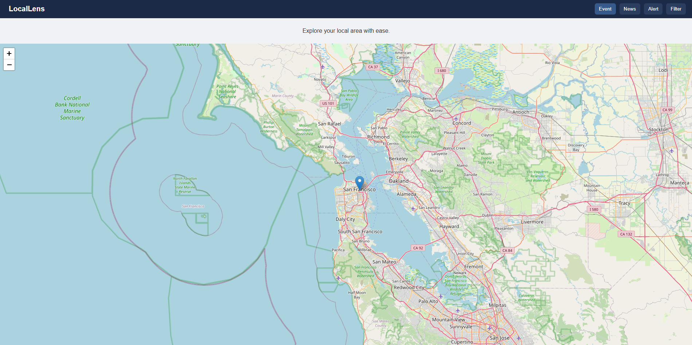

# 📍 LocalLens — Real-Time Hyperlocal Event & News Map

**LocalLens** is a web-based interactive map that displays real-time local events, news, and alerts based on a user's location. It combines geolocation, live data from APIs, and visual mapping to help users explore their surroundings with meaningful, timely information.

---

## 🌟 Features

- 🗺️ Interactive map powered by **Leaflet.js** and **OpenStreetMap**
- 📍 Real-time markers for **events**, **news**, and **local alerts**
- 📡 Fetches live data based on your **current location**
- 📌 Smart filtering (by category and distance)
- 🎯 Minimal design with fast, mobile-friendly layout
- 🚫 No account, no credit card, no API key required (Mapbox alternative)

---

## 📸 Screenshot

---

## 🧑‍💻 Tech Stack

| Layer         | Tech                                   |
|---------------|----------------------------------------|
| **Frontend**  | HTML, CSS, JavaScript                  |
| **Map Engine**| Leaflet.js + OpenStreetMap             |
| **Data APIs** | [NewsAPI](https://newsapi.org/), [Eventbrite](https://www.eventbrite.com/developer/v3/), RSS feeds |
| **Tools**     | Geolocation API, Haversine formula for proximity, Custom markers |

---

# 🧠 How It Works
- The browser asks for your current location

- Once permission is granted, it:

- Centers the map on your area

- Calls APIs to get nearby events and news headlines

- Filters them by distance (e.g., 10 km radius)

- Displays markers on the map only for active, local data

- The app refreshes the data periodically to simulate real-time updates

# 🎯 Future Features
🔍 Search bar to explore events in other cities

👥 User-submitted events with moderation

🔔 Push/local notifications for nearby alerts

exclude:
  - README.md
📱 Progressive Web App (PWA) version

🧠 AI-based tagging of news/events by relevance

